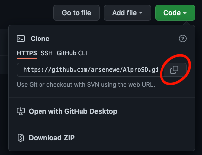
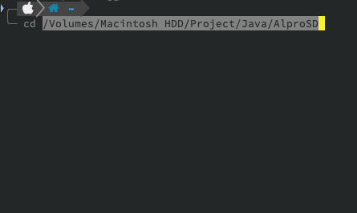
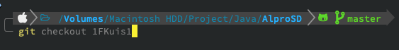
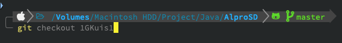
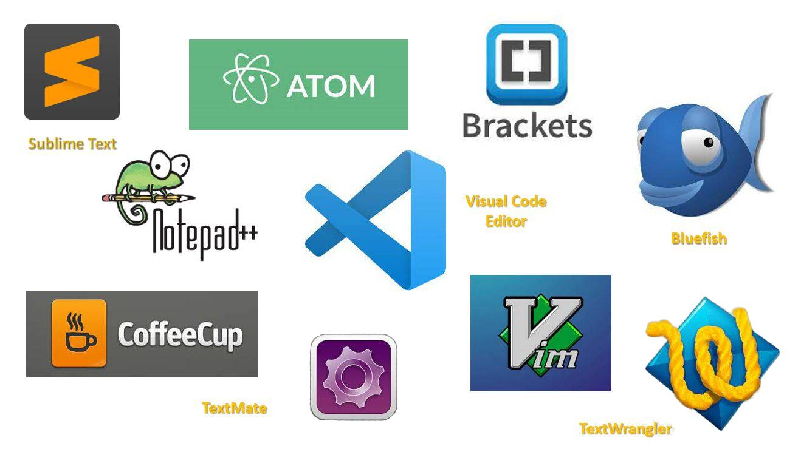

# PETUNJUK PENGGUNAAN LAYOUT

1. Masuk ke [repositori](https://github.com/arsenewe/AlproSD/tree/master)
   
2. Perhatikan menu Branch.
   
3. Klik menu tersebut, maka akan muncul pilihan beberapa branch.

   

4. Pilih salah satu Branch melalui klik Branch yang dipilih.

   

5. Lakukan clone repo

   

6. Buka terminal atau command prompt, masuk ke direktori repo lokal (hasil clone).
   
7. Ketik `git checkout <sesuai_Branch_kelas>`
   
   
8. Buka editor
   
9. _Happy Coding_
