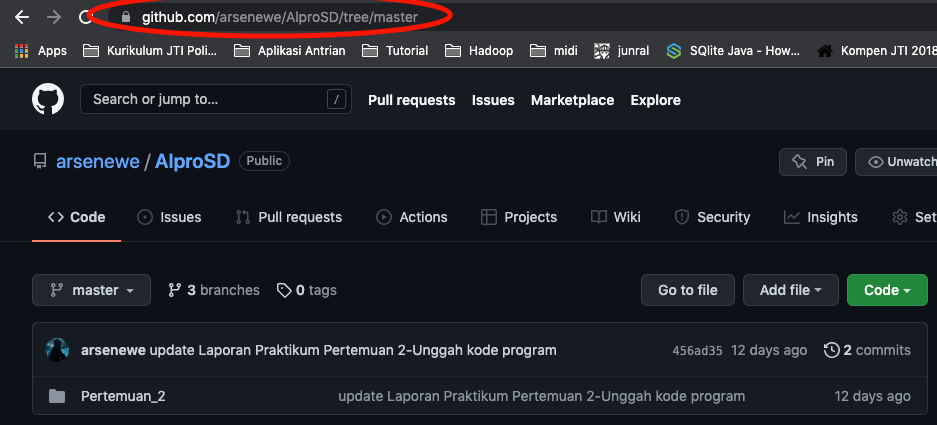
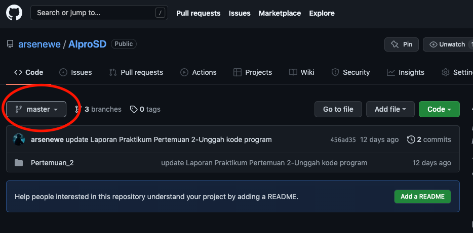
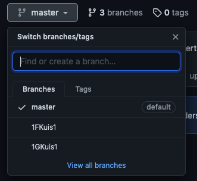

# PETUNJUK PENGGUNAAN LAYOUT

1. Masuk ke [repositori](https://github.com/arsenewe/AlproSD/tree/master)
   
2. Perhatikan menu Branch.
   
3. Klik menu tersebut, maka akan muncul pilihan beberapa branch.

   

4. Pilih salah satu Branch melalui klik Branch yang dipilih.
5. Lakukan clone repo dan _Happy Coding_
